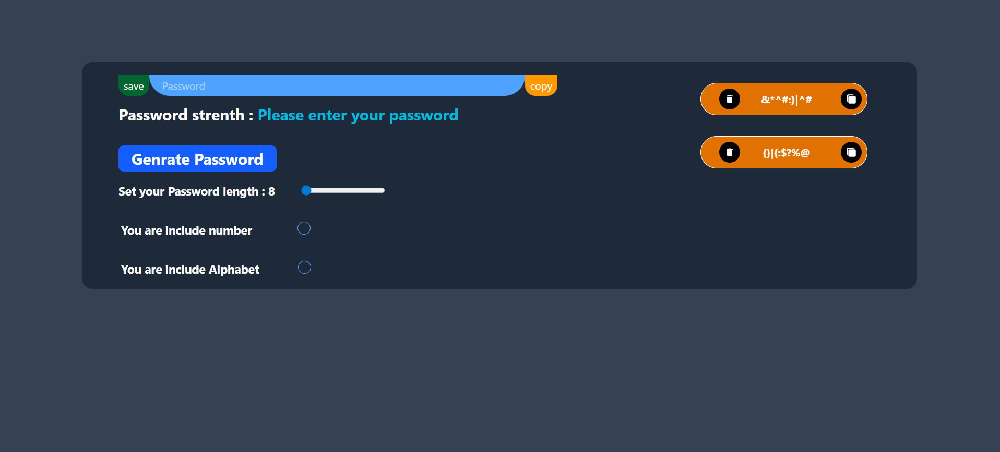

# 🔐 Password Generator App

A simple yet powerful **Password Generator** built with **React** and **Tailwind CSS**.  
It allows users to generate secure passwords with customizable options and manage them using browser **localStorage**.

---

## 🚀 Features

- 🔢 **Custom Password Options** – Choose to include numbers, alphabets, and special characters.  
- 🎚️ **Adjustable Length** – Control password length with a range slider.  
- 💾 **Save Passwords** – Store generated passwords in localStorage.  
- 🗑️ **Delete Saved Passwords** – Remove unwanted passwords anytime.  
- 📋 **Copy to Clipboard** – Instantly copy passwords with one click.  
- 🧊 **Beautiful UI** – Clean layout made with Tailwind CSS and a subtle blur background effect.  
- ♻️ **Auto Reset** – Password field clears automatically when the page reloads.

---

## 🖥️ Tech Stack

- **React.js**
- **Tailwind CSS**
- **zxcvbn** (for password strength analysis)
- **React Icons** (for buttons and icons)

---

## 🧩 How It Works

1. Adjust the password length using the slider.  
2. Choose whether to include numbers and alphabets.  
3. Click **Generate Password** to create one.  
4. Optionally click **Save** to store it locally.  
5. You can **Copy** or **Delete** any saved password.  

Passwords are stored in your browser’s `localStorage`, so they persist across sessions.

---

## 📸 UI Preview

